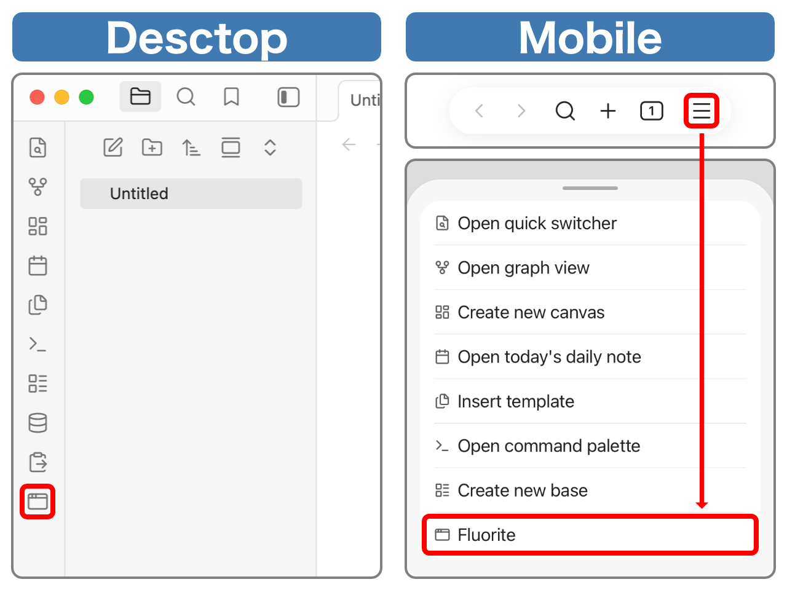
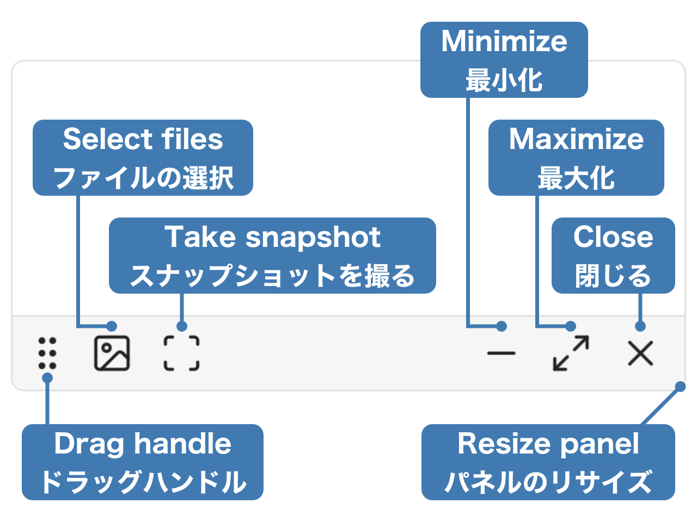

# Fluorite

## Features / 機能概要

This plugin adds the following features to Obsidian.

- Display image files from the device on the floating panel.
- Display Obsidian note on the floating panel.

このプラグインはObsidianに以下の機能を追加します

- 端末の画像ファイルをフローティングパネルに表示する
- Obsidianのノートをフローティングパネルに表示する

</img>

## Installation / インストール方法

Obsidian Settings > Community plugins > Browse > Type 'fluorite' into the search box > Select the 'Fluorite' card > Install > Enable

Obsidianの設定 > コミュニティプラグイン > 閲覧 > 検索ボックスに「fluorite」と入力 > 「Fluorite」のカードを選択 > インストール > 有効

## Usage / 使い方

### Open the floating panel / フローティングパネルを開く

Desktop: Ribbon menu > Window icon button  
Mobile: Menu icon button on the navigation bar > Fluorite

デスクトップ：リボンメニュー > ウィンドウアイコンボタン  
モバイル：ナビゲーションバーのメニューボタン > Fluorite

### List of Operations / 操作一覧

### Display image files on the device / 端末の画像ファイルを表示

Photo icon Button on the floating panel > Select images to display (multiple selections allowed)

フローティングパネルの写真アイコンボタン > 表示したい画像を選択（複数選択可能）

### Display Obsidian note / Obsidianのノートを表示

Open the note to display > Scan icon button on the floating panel

A snapshot of the current state will be taken and displayed. Any edits made to the note will not be reflected in the snapshot. Also, the snapshot is read-only.

表示したいノートを開く > フローティングパネルのスキャンアイコンボタン

その時点でのスナップショットを取得し表示します。ノートに加えた編集内容はスナップショットに反映されません。また、スナップショットは読み取り専用です。
